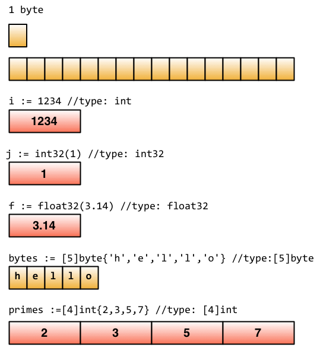
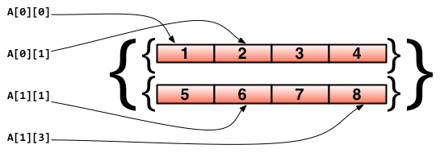
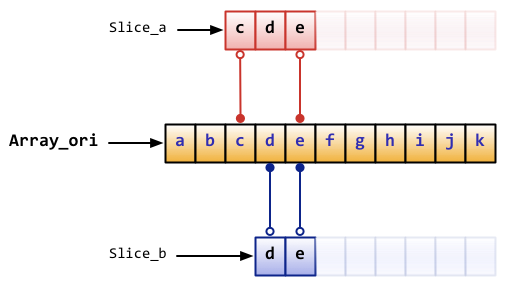

# 2.2 Go 基礎

這小節我們將要介紹如何定義變數、常數、Go 內建型別以及 Go 程式設計中的一些技巧。

## 定義變數

Go 語言裡面定義變數有多種方式。

使用 `var` 關鍵字是 Go 最基本的定義變數方式，與 C 語言不同的是 Go 把變數型別放在變數名後面：
```Go

//定義一個名稱為“variableName”，型別為"type"的變數
var variableName type
```
定義多個變數
```Go

//定義三個型別都是“type”的變數
var vname1, vname2, vname3 type
```
定義變數並初始化值
```Go

//初始化“variableName”的變數為“value”值，型別是“type”
var variableName type = value
```
同時初始化多個變數
```Go

/*
	定義三個型別都是"type"的變數，並且分別初始化為相應的值
	vname1 為 v1，vname2 為 v2，vname3 為 v3
*/
var vname1, vname2, vname3 type= v1, v2, v3
```
你是不是覺得上面這樣的定義有點繁瑣？沒關係，因為 Go 語言的設計者也發現了，有一種寫法可以讓它變得簡單一點。我們可以直接忽略型別宣告，那麼上面的程式碼變成這樣了：
```Go

/*
	定義三個變數，它們分別初始化為相應的值
	vname1 為 v1，vname2 為 v2，vname3 為 v3
	然後 Go 會根據其相應值的型別來幫你初始化它們
*/
var vname1, vname2, vname3 = v1, v2, v3
```
你覺得上面的還是有些繁瑣？好吧，我也覺得。讓我們繼續簡化：
```Go

/*
	定義三個變數，它們分別初始化為相應的值
	vname1 為 v1，vname2 為 v2，vname3 為 v3
	編譯器會根據初始化的值自動推匯出相應的型別
*/
vname1, vname2, vname3 := v1, v2, v3
```
現在是不是看上去非常簡潔了？`:=`這個符號直接取代了 `var` 和`type`，這種形式叫做簡短宣告。不過它有一個限制，那就是它只能用在函式內部；在函式外部使用則會無法編譯透過，所以一般用 `var` 方式來定義全域性變數。

`_`（下劃線）是個特殊的變數名，任何賦予它的值都會被丟棄。在這個例子中，我們將值 `35` 賦予`b`，並同時丟棄`34`：

	_, b := 34, 35

Go 對於已宣告但未使用的變數會在編譯階段報錯，比如下面的程式碼就會產生一個錯誤：宣告了 `i` 但未使用。
```Go

package main

func main() {
	var i int
}
```
## 常數

所謂常數，也就是在程式編譯階段就確定下來的值，而程式在執行時無法改變該值。在 Go 程式中，常數可定義為數值、布林值或字串等型別。

它的語法如下：
```Go

const constantName = value
//如果需要，也可以明確指定常數的型別：
const Pi float32 = 3.1415926
```
下面是一些常數宣告的例子：
```Go

const Pi = 3.1415926
const i = 10000
const MaxThread = 10
const prefix = "astaxie_"
```
Go 常數和一般程式語言不同的是，可以指定相當多的小數位數(例如 200 位)，
若指定給 float32 自動縮短為 32bit，指定給 float64 自動縮短為 64bit，詳情參考 [ 連結](http://golang.org/ref/spec#Constants)

## 內建基礎型別

### Boolean

在 Go 中，布林值的型別為`bool`，值是 `true` 或`false`，預設為`false`。
```Go

//範例程式碼
var isActive bool  // 全域性變數宣告
var enabled, disabled = true, false  // 忽略型別的宣告
func test() {
	var available bool  // 一般宣告
	valid := false      // 簡短宣告
	available = true    // 賦值操作
}
```

### 數值型別

整數型別有無符號和帶符號兩種。Go 同時支援 `int` 和`uint`，這兩種型別的長度相同，但具體長度取決於不同編譯器的實現。Go 裡面也有直接定義好位數的型別：`rune`, `int8`, `int16`, `int32`, `int64`和`byte`, `uint8`, `uint16`, `uint32`, `uint64`。其中 `rune` 是`int32`的別稱，`byte`是 `uint8` 的別稱。

>需要注意的一點是，這些型別的變數之間不允許互相賦值或操作，不然會在編譯時引起編譯器報錯。
>
>如下的程式碼會產生錯誤：invalid operation: a + b (mismatched types int8 and int32)
>
>>	var a int8

>>	var b int32

>>	c:=a + b
>
>另外，儘管 int 的長度是 32 bit, 但 int 與 int32 並不可以互用。

浮點數的型別有 `float32` 和`float64`兩種（沒有 `float` 型別），預設是`float64`。

這就是全部嗎？No！Go 還支援複數。它的預設型別是`complex128`（64 位實數+64 位虛數）。如果需要小一些的，也有`complex64`(32 位實數+32 位虛數)。複數的形式為`RE + IMi`，其中 `RE` 是實數部分，`IM`是虛數部分，而最後的 `i` 是虛數單位。下面是一個使用複數的例子：
```Go

var c complex64 = 5+5i
//output: (5+5i)
fmt.Printf("Value is: %v", c)
```

### 字串

我們在上一節中講過，Go 中的字串都是採用`UTF-8`字符集編碼。字串是用一對雙引號（`""`）或反引號（`` ` `` `` ` ``）括起來定義，它的型別是`string`。
```Go

//範例程式碼
var frenchHello string  // 宣告變數為字串的一般方法
var emptyString string = ""  // 宣告了一個字串變數，初始化為空字串
func test() {
	no, yes, maybe := "no", "yes", "maybe"  // 簡短宣告，同時宣告多個變數
	japaneseHello := "Konichiwa"  // 同上
	frenchHello = "Bonjour"  // 常規賦值
}
```
在 Go 中字串是不可變的，例如下面的程式碼編譯時會報錯：cannot assign to s[0]
```Go

var s string = "hello"
s[0] = 'c'

```
但如果真的想要修改怎麼辦呢？下面的程式碼可以實現：
```Go

s := "hello"
c := []byte(s)  // 將字串 s 轉換為 []byte 型別
c[0] = 'c'
s2 := string(c)  // 再轉換回 string 型別
fmt.Printf("%s\n", s2)
```

Go 中可以使用`+`運算子來連線兩個字串：
```Go

s := "hello,"
m := " world"
a := s + m
fmt.Printf("%s\n", a)
```
修改字串也可寫為：
```Go

s := "hello"
s = "c" + s[1:] // 字串雖不能更改，但可進行切片(slice)操作
fmt.Printf("%s\n", s)
```
如果要宣告一個多行的字串怎麼辦？可以透過`` ` ``來宣告：

	m := `hello
		world`

`` ` `` 括起的字串為 Raw 字串，即字串在程式碼中的形式就是列印時的形式，它沒有字元轉義，換行也將原樣輸出。例如本例中會輸出：

    hello
		world

### 錯誤型別
Go 內建有一個 `error` 型別，專門用來處理錯誤資訊，Go 的 `package` 裡面還專門有一個套件 `errors` 來處理錯誤：
```Go

err := errors.New("emit macho dwarf: elf header corrupted")
if err != nil {
	fmt.Print(err)
}
```
### Go 資料底層的儲存

下面這張圖來源於[Russ Cox Blog](http://research.swtch.com/)中一篇介紹 [Go 資料結構](http://research.swtch.com/godata)的文章，大家可以看到這些基礎型別底層都是分配了一塊記憶體，然後儲存了相應的值。



圖 2.1 Go 資料格式的儲存

## 一些技巧

### 分組宣告

在 Go 語言中，同時宣告多個常數、變數，或者匯入多個套件時，可採用分組的方式進行宣告。

例如下面的程式碼：
```Go

import "fmt"
import "os"

const i = 100
const pi = 3.1415
const prefix = "Go_"

var i int
var pi float32
var prefix string
```
可以分組寫成如下形式：
```Go

import(
	"fmt"
	"os"
)

const(
	i = 100
	pi = 3.1415
	prefix = "Go_"
)

var(
	i int
	pi float32
	prefix string
)
```
### iota 列舉

Go 裡面有一個關鍵字 `iota`，這個關鍵字用來宣告 `enum` 的時候採用，它預設開始值是 0，const 中每增加一行加 1：
```Go

package main

import (
	"fmt"
)

const (
	x = iota // x == 0
	y = iota // y == 1
	z = iota // z == 2
	w        // 常數宣告省略值時，預設和之前一個值的字面相同。這裡隱含的說 w = iota，因此 w == 3。其實上面 y 和 z 可同樣不用"= iota"
)

const v = iota // 每遇到一個 const 關鍵字，iota 就會重置，此時 v == 0

const (
	h, i, j = iota, iota, iota //h=0,i=0,j=0 iota 在同一行值相同
)

const (
	a       = iota //a=0
	b       = "B"
	c       = iota             //c=2
	d, e, f = iota, iota, iota //d=3,e=3,f=3
	g       = iota             //g = 4
)

func main() {
	fmt.Println(a, b, c, d, e, f, g, h, i, j, x, y, z, w, v)
}
```
>除非被明確的設定為其它值或`iota`，每個 `const` 分組的第一個常數被預設設定為它的 0 值，第二及後續的常數被預設設定為它前面那個常數的值，如果前面那個常數的值是`iota`，則它也被設定為`iota`。

### Go 程式設計的一些規則
Go 之所以會那麼簡潔，是因為它有一些預設的行為：
- 大寫字母開頭的變數是可匯出的，也就是其它套件可以讀取的，是公有變數；小寫字母開頭的就是不可匯出的，是私有變數。
- 大寫字母開頭的函式也是一樣，相當於 `class` 中的帶 `public` 關鍵詞的公有函式；小寫字母開頭的就是有 `private` 關鍵詞的私有函式。

## array、slice、map

### array
`array`就是陣列，它的定義方式如下：
```Go

var arr [n]type
```
在 `[n]type` 中，`n`表示陣列的長度，`type`表示儲存元素的型別。對陣列的操作和其它語言類似，都是透過 `[]` 來進行讀取或賦值：
```Go

var arr [10]int  // 宣告了一個 int 型別的陣列
arr[0] = 42      // 陣列下標是從 0 開始的
arr[1] = 13      // 賦值操作
fmt.Printf("The first element is %d\n", arr[0])  // 取得資料，回傳 42
fmt.Printf("The last element is %d\n", arr[9]) //回傳未賦值的最後一個元素，預設回傳 0
```
由於長度也是陣列型別的一部分，因此 `[3]int` 與`[4]int`是不同的型別，陣列也就不能改變長度。陣列之間的賦值是值的賦值，即當把一個陣列作為參數傳入函式的時候，傳入的其實是該陣列的副本，而不是它的指標。如果要使用指標，那麼就需要用到後面介紹的 `slice` 型別了。

陣列可以使用另一種 `:=` 來宣告
```Go

a := [3]int{1, 2, 3} // 宣告了一個長度為 3 的 int 陣列

b := [10]int{1, 2, 3} // 宣告了一個長度為 10 的 int 陣列，其中前三個元素初始化為 1、2、3，其它預設為 0

c := [...]int{4, 5, 6} // 可以省略長度而採用`...`的方式，Go 會自動根據元素個數來計算長度
```
也許你會說，我想陣列裡面的值還是陣列，能實現嗎？當然咯，Go 支援巢狀陣列，即多維陣列。比如下面的程式碼就宣告了一個二維陣列：
```Go

// 宣告了一個二維陣列，該陣列以兩個陣列作為元素，其中每個陣列中又有 4 個 int 型別的元素
doubleArray := [2][4]int{[4]int{1, 2, 3, 4}, [4]int{5, 6, 7, 8}}

// 上面的宣告可以簡化，直接忽略內部的型別
easyArray := [2][4]int{{1, 2, 3, 4}, {5, 6, 7, 8}}
```
陣列的分配如下所示：



圖 2.2 多維陣列的對映關係


### slice

在很多應用場景中，陣列並不能滿足我們的需求。在初始定義陣列時，我們並不知道需要多大的陣列，因此我們就需要“動態陣列”。在 Go 裡面這種資料結構叫`slice`

`slice`並不是真正意義上的動態陣列，而是一個參考型別。`slice`總是指向一個底層`array`，`slice`的宣告也可以像 `array` 一樣，只是不需要長度。
```Go

// 和宣告 array 一樣，只是少了長度
var fslice []int
```
接下來我們可以宣告一個`slice`，並初始化資料，如下所示：
```Go

slice := []byte {'a', 'b', 'c', 'd'}
```
`slice`可以從一個陣列或一個已經存在的 `slice` 中再次宣告。`slice`透過 `array[i:j]` 來取得，其中 `i` 是陣列的開始位置，`j`是結束位置，但不包含`array[j]`，它的長度是`j-i`。
```Go

// 宣告一個含有 10 個元素元素型別為 byte 的陣列
var ar = [10]byte {'a', 'b', 'c', 'd', 'e', 'f', 'g', 'h', 'i', 'j'}

// 宣告兩個含有 byte 的 slice
var a, b []byte

// a 指向陣列的第 3 個元素開始，併到第五個元素結束，
a = ar[2:5]
//現在 a 含有的元素: ar[2]、ar[3]和 ar[4]

// b 是陣列 ar 的另一個 slice
b = ar[3:5]
// b 的元素是：ar[3]和 ar[4]
```
>注意 `slice` 和陣列在宣告時的區別：宣告陣列時，方括號內寫明了陣列的長度或使用`...`自動計算長度，而宣告 `slice` 時，方括號內沒有任何字元。

它們的資料結構如下所示



圖 2.3 slice 和 array 的對應關係圖

slice 有一些簡便的操作

 - `slice`的預設開始位置是 0，`ar[:n]`等價於`ar[0:n]`
 - `slice`的第二個序列預設是陣列的長度，`ar[n:]`等價於`ar[n:len(ar)]`
 - 如果從一個陣列裡面直接取得`slice`，可以這樣`ar[:]`，因為預設第一個序列是 0，第二個是陣列的長度，即等價於`ar[0:len(ar)]`

下面這個例子展示了更多關於 `slice` 的操作：
```Go

// 宣告一個陣列
var array = [10]byte{'a', 'b', 'c', 'd', 'e', 'f', 'g', 'h', 'i', 'j'}
// 宣告兩個 slice
var aSlice, bSlice []byte

// 示範一些簡便操作
aSlice = array[:3] // 等價於 aSlice = array[0:3] aSlice 包含元素: a,b,c
aSlice = array[5:] // 等價於 aSlice = array[5:10] aSlice 包含元素: f,g,h,i,j
aSlice = array[:]  // 等價於 aSlice = array[0:10] 這樣 aSlice 包含了全部的元素

// 從 slice 中取得 slice
aSlice = array[3:7]  // aSlice 包含元素: d,e,f,g，len=4，cap=7
bSlice = aSlice[1:3] // bSlice 包含 aSlice[1], aSlice[2] 也就是含有: e,f
bSlice = aSlice[:3]  // bSlice 包含 aSlice[0], aSlice[1], aSlice[2] 也就是含有: d,e,f
bSlice = aSlice[0:5] // 對 slice 的 slice 可以在 cap 範圍內擴充套件，此時 bSlice 包含：d,e,f,g,h
bSlice = aSlice[:]   // bSlice 包含所有 aSlice 的元素: d,e,f,g
```
`slice`是參考型別，所以當參考改變其中元素的值時，其它的所有參考都會改變該值，例如上面的 `aSlice` 和`bSlice`，如果修改了 `aSlice` 中元素的值，那麼 `bSlice` 相對應的值也會改變。

從概念上面來說 `slice` 像一個結構體，這個結構體包含了三個元素：
- 一個指標，指向陣列中 `slice` 指定的開始位置
- 長度，即 `slice` 的長度
- 最大長度，也就是 `slice` 開始位置到陣列的最後位置的長度
```Go

	Array_a := [10]byte{'a', 'b', 'c', 'd', 'e', 'f', 'g', 'h', 'i', 'j'}
	Slice_a := Array_a[2:5]
```
上面程式碼的真正儲存結構如下圖所示


圖 2.4 slice 對應陣列的資訊

對於 `slice` 有幾個有用的內建函式：

- `len`    取得 `slice` 的長度
- `cap`    取得 `slice` 的最大容量
- `append` 向 `slice` 裡面追加一個或者多個元素，然後回傳一個和 `slice` 一樣型別的`slice`
- `copy`   函式 `copy` 從源 `slice` 的`src`中複製元素到目標`dst`，並且回傳複製的元素的個數

注：`append`函式會改變 `slice` 所參考的陣列的內容，從而影響到參考同一陣列的其它`slice`。
但當 `slice` 中沒有剩餘空間（即`(cap-len) == 0`）時，此時將動態分配新的陣列空間。回傳的 `slice` 陣列指標將指向這個空間，而原陣列的內容將保持不變；其它參考此陣列的 `slice` 則不受影響。

從 Go1.2 開始 slice 支援了三個參數的 slice，之前我們一直採用這種方式在 slice 或者 array 基礎上來取得一個 slice
```Go

var array [10]int
slice := array[2:4]
```
這個例子裡面 slice 的容量是 8，新版本里面可以指定這個容量

	slice = array[2:4:7]

上面這個的容量就是`7-2`，即 5。這樣這個產生的新的 slice 就沒辦法訪問最後的三個元素。

如果 slice 是這樣的形式`array[:i:j]`，即第一個參數為空，預設值就是 0。

### map

`map`也就是 Python 中字典的概念，它的格式為`map[keyType]valueType`

我們看下面的程式碼，`map`的讀取和設定也類似 `slice` 一樣，透過 `key` 來操作，只是 `slice` 的`index`只能是｀int｀型別，而 `map` 多了很多型別，可以是`int`，可以是 `string` 及所有完全定義了 `==` 與`!=`操作的型別。
```Go

// 宣告一個 key 是字串，值為 int 的字典，這種方式的宣告需要在使用之前使用 make 初始化
var numbers map[string]int
// 另一種 map 的宣告方式
numbers = make(map[string]int)
numbers["one"] = 1  //賦值
numbers["ten"] = 10 //賦值
numbers["three"] = 3

fmt.Println("第三個數字是: ", numbers["three"]) // 讀取資料
// 顯示出來如 : 第三個數字是: 3
```

這個 `map` 就像我們平常看到的表格一樣，左邊列是`key`，右邊列是值

使用 map 過程中需要注意的幾點：
- `map`是無序的，每次顯示出來的 `map` 都會不一樣，它不能透過 `index` 取得，而必須透過 `key` 取得
- `map`的長度是不固定的，也就是和 `slice` 一樣，也是一種參考型別
- 內建的 `len` 函式同樣適用於`map`，回傳 `map` 擁有的 `key` 的數量
- `map`的值可以很方便的修改，透過`numbers["one"]=11`可以很容易的把 key 為`one`的字典值改為`11`
- `map`和其他基本型別不同，它不是 thread-safe，在多個 go-routine 存取時，必須使用 mutex lock 機制

`map`的初始化可以透過 `key:val` 的方式初始化值，同時 `map` 內建有判斷是否存在 `key` 的方式

透過 `delete` 刪除 `map` 的元素：

```Go

// 初始化一個字典
rating := map[string]float32{"C":5, "Go":4.5, "Python":4.5, "C++":2 }
// map 有兩個回傳值，第二個回傳值，如果不存在 key，那麼 ok 為 false，如果存在 ok 為 true
csharpRating, ok := rating["C#"]
if ok {
	fmt.Println("C# is in the map and its rating is ", csharpRating)
} else {
	fmt.Println("We have no rating associated with C# in the map")
}

delete(rating, "C")  // 刪除 key 為 C 的元素

```
上面說過了，`map`也是一種參考型別，如果兩個 `map` 同時指向一個底層，那麼一個改變，另一個也相應的改變：
```Go

m := make(map[string]string)
m["Hello"] = "Bonjour"
m1 := m
m1["Hello"] = "Salut"  // 現在 m["hello"]的值已經是 Salut 了

```
### make、new 操作

`make`用於內建型別（`map`、`slice` 和`channel`）的記憶體分配。`new`用於各種型別的記憶體分配。

內建函式 `new` 本質上說跟其它語言中的同名函式功能一樣：`new(T)`分配了零值填充的 `T` 型別的記憶體空間，並且回傳其地址，即一個`*T`型別的值。用 Go 的術語說，它回傳了一個指標，指向新分配的型別 `T` 的零值。有一點非常重要：

>`new`回傳指標。

內建函式`make(T, args)`與`new(T)`有著不同的功能，make 只能建立`slice`、`map`和`channel`，並且回傳一個有初始值(非零)的 `T` 型別，而不是`*T`。本質來講，導致這三個型別有所不同的原因是指向資料結構的參考在使用前必須被初始化。例如，一個`slice`，是一個包含指向資料（內部`array`）的指標、長度和容量的三項描述符；在這些專案被初始化之前，`slice`為`nil`。對於`slice`、`map`和 `channel` 來說，`make`初始化了內部的資料結構，填充適當的值。

>`make`回傳初始化後的（非零）值。

下面這個圖詳細的解釋了 `new` 和`make`之間的區別。


圖 2.5 make 和 new 對應底層的記憶體分配


## 零值
關於“零值”，所指並非是空值，而是一種“變數未填充前”的預設值，通常為 0。
此處羅列 部分類型 的 “零值”
```Go

int     0
int8    0
int32   0
int64   0
uint    0x0
rune    0 //rune 的實際型別是 int32
byte    0x0 // byte 的實際型別是 uint8
float32 0 //長度為 4 byte
float64 0 //長度為 8 byte
bool    false
string  ""

```
## links
   * [目錄](<preface.md>)
   * 上一章: [你好,Go](<02.1.md>)
   * 下一節: [流程和函式](<02.3.md>)
