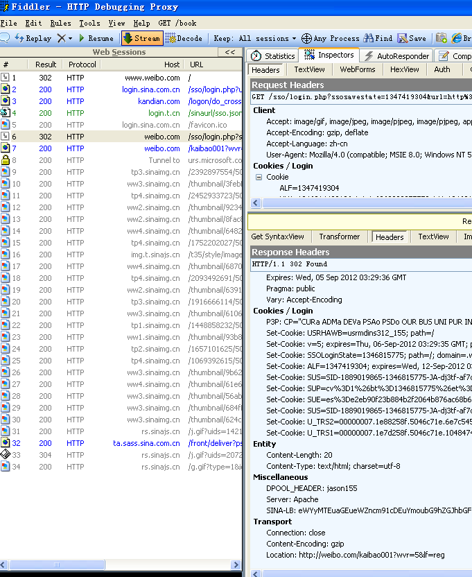
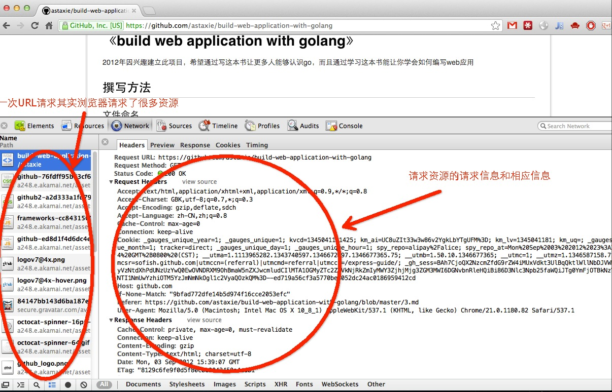

# 3.1 Web 工作方式

我們平時瀏覽網頁的時候，會開啟瀏覽器，輸入網址後按下回車鍵，然後就會顯示出你想要瀏覽的內容。在這個看似簡單的使用者行為背後，到底隱藏了些什麼呢？

對於普通的上網過程，系統其實是這樣做的：瀏覽器本身是一個客戶端，當你輸入 URL 的時候，首先瀏覽器會去請求 DNS 伺服器，透過 DNS 取得相應的域名對應的 IP，然後透過 IP 地址找到 IP 對應的伺服器後，要求建立 TCP 連線，等瀏覽器傳送完 HTTP Request（請求）封包後，伺服器接收到請求封包之後才開始處理請求封包，伺服器呼叫自身服務，回傳 HTTP Response 內容；客戶端收到來自伺服器的回應後開始渲染這個 Response 套件裡的主體（body），等收到全部的內容隨後斷開與該伺服器之間的 TCP 連線。

圖 3.1 使用者存取一個 Web 站點的過程

 一個 Web 伺服器也被稱為 HTTP 伺服器，它透過 HTTP 協議與客戶端通訊。這個客戶端通常指的是 Web 瀏覽器(其實手機端客戶端內部也是瀏覽器實現的)。

Web 伺服器的工作原理可以簡單地歸納為：

- 客戶端透過 TCP/IP 協議建立到伺服器的 TCP 連線
- 客戶端向伺服器傳送 HTTP 協議請求封包，請求伺服器裡的資源文件
- 伺服器向客戶端發送 HTTP 協議回應封包，如果請求的資源包含有動態語言的內容，那麼伺服器會呼叫動態語言的解釋引擎負責處理“動態內容”，並將處理得到的資料回傳給客戶端
- 客戶端與伺服器斷開。由客戶端解釋 HTML 文件，在客戶端螢幕上渲染圖形結果

一個簡單的 HTTP 事務就是這樣實現的，看起來很複雜，原理其實是挺簡單的。需要注意的是客戶端與伺服器之間的通訊是非持久連線的，也就是當伺服器傳送了回應後就與客戶端斷開連線，等待下一次請求。

## URL 和 DNS 解析
我們瀏覽網頁都是透過 URL 存取的，那麼 URL 到底是怎麼樣的呢？

URL(Uniform Resource Locator)是“統一資源定位符”的英文縮寫，用於描述一個網路上的資源, 基本格式如下

	scheme://host[:port#]/path/.../[?query-string][#anchor]
	scheme         指定底層使用的協議(例如：http, https, ftp)
	host           HTTP 伺服器的 IP 地址或者域名
	port#          HTTP 伺服器的預設埠是 80，這種情況下埠號可以省略。如果使用了別的埠，必須指明，例如 http://www.cnblogs.com:8080/
	path           存取資源的路徑
	query-string   傳送給 http 伺服器的資料
	anchor         錨

 DNS(Domain Name System)是“域名系統”的英文縮寫，是一種組織成域層次結構的計算機和網路服務命名系統，它用於 TCP/IP 網路，它從事將主機名或域名轉換為實際 IP 地址的工作。DNS 就是這樣的一位“翻譯官”，它的基本工作原理可用下圖來表示。

圖 3.2 DNS 工作原理

更詳細的 DNS 解析的過程如下，這個過程有助於我們理解 DNS 的工作模式

1. 在瀏覽器中輸入 www.qq.com 域名，作業系統會先檢查自己本地的 hosts 檔案是否有這個網址對映關係，如果有，就先呼叫這個 IP 地址對映，完成域名解析。

2. 如果 hosts 裡沒有這個域名的對映，則查詢本地 DNS 解析器快取，是否有這個網址對映關係，如果有，直接回傳，完成域名解析。

3. 如果 hosts 與本地 DNS 解析器快取都沒有相應的網址對映關係，首先會找 TCP/IP 參數中設定的首選 DNS 伺服器，在此我們叫它本地 DNS 伺服器，此伺服器收到查詢時，如果要查詢的域名，包含在本地配置區域資源中，則回傳解析結果給客戶端，完成域名解析，此解析具有權威性。

4. 如果要查詢的域名，不由本地 DNS 伺服器區域解析，但該伺服器已快取了此網址對映關係，則呼叫這個 IP 地址對映，完成域名解析，此解析不具有權威性。

5. 如果本地 DNS 伺服器本地區域檔案與快取解析都失效，則根據本地 DNS 伺服器的設定（是否設定轉發器）進行查詢，如果未用轉發模式，本地 DNS 就把請求發至 “根 DNS 伺服器”，“根 DNS 伺服器”收到請求後會判斷這個域名(.com)是誰來授權管理，並會回傳一個負責該頂級域名伺服器的一個 IP。本地 DNS 伺服器收到 IP 資訊後，將會聯絡負責.com 域的這臺伺服器。這臺負責.com 域的伺服器收到請求後，如果自己無法解析，它就會找一個管理.com 域的下一級 DNS 伺服器地址(qq.com)給本地 DNS 伺服器。當本地 DNS 伺服器收到這個地址後，就會找 qq.com 域伺服器，重複上面的動作，進行查詢，直至找到 www.qq.com 主機。

6. 如果用的是轉發模式，此 DNS 伺服器就會把請求轉發至上一級 DNS 伺服器，由上一級伺服器進行解析，上一級伺服器如果不能解析，或找根 DNS 或把轉請求轉至上上級，以此迴圈。不管本地 DNS 伺服器用的是轉發，還是根提示，最後都是把結果回傳給本地 DNS 伺服器，由此 DNS 伺服器再回傳給客戶端。

圖 3.3 DNS 解析的整個流程

> 所謂 `遞迴查詢過程` 就是 “查詢的提交者” 更替, 而 `迭代查詢過程` 則是 “查詢的提交者”不變。
>
> 舉個例子來說，你想知道某個一起上法律課的女孩的電話，並且你偷偷拍了她的照片，回到寢室告訴一個很仗義的哥們兒，這個哥們兒二話沒說，拍著胸脯告訴你，甭急，我替你查(此處完成了一次遞迴查詢，即，問詢者的角色更替)。然後他拿著照片問了學院大四學長，學長告訴他，這姑娘是 xx 系的；然後這哥們兒馬不停蹄又問了 xx 系的辦公室主任助理同學，助理同學說是 xx 系 yy 班的，然後很仗義的哥們兒去 xx 系 yy 班的班長那裡取到了該女孩兒電話。(此處完成若干次迭代查詢，即，問詢者角色不變，但反覆更替問詢物件)最後，他把號碼交到了你手裡。完成整個查詢過程。

透過上面的步驟，我們最後取得的是 IP 地址，也就是瀏覽器最後發起請求的時候是基於 IP 來和伺服器做資訊互動的。

## HTTP 協議詳解

HTTP 協議是 Web 工作的核心，所以要了解清楚 Web 的工作方式就需要詳細的了解清楚 HTTP 是怎麼樣工作的。

HTTP 是一種讓 Web 伺服器與瀏覽器(客戶端)透過 Internet 傳送與接收資料的協議，它建立在 TCP 協議之上，一般採用 TCP 的 80 埠。它是一個請求、回應協議--客戶端發出一個請求，伺服器回應這個請求。在 HTTP 中，客戶端總是透過建立一個連線與傳送一個 HTTP 請求來發起一個事務。伺服器不能主動去與客戶端聯絡，也不能給客戶端發出一個回呼(Callback)連線。客戶端與伺服器端都可以提前中斷一個連線。例如，當瀏覽器下載一個檔案時，你可以透過點選“停止”鍵來中斷檔案的下載，關閉與伺服器的 HTTP 連線。

HTTP 協議是無狀態的，同一個客戶端的這次請求和上次請求是沒有對應關係的，對 HTTP 伺服器來說，它並不知道這兩個請求是否來自同一個客戶端。為了解決這個問題， Web 程式引入了 Cookie 機制來維護連線的可持續狀態。

>HTTP 協議是建立在 TCP 協議之上的，因此 TCP 攻擊一樣會影響 HTTP 的通訊，例如比較常見的一些攻擊：SYN Flood 是當前最流行的 DoS（拒絕服務攻擊）與 DdoS（分散式拒絕服務攻擊）的方式之一，這是一種利用 TCP 協議缺陷，傳送大量偽造的 TCP 連線請求，從而使得被攻擊方資源耗盡（CPU 滿負荷或記憶體不足）的攻擊方式。

### HTTP 請求封包（瀏覽器資訊）

我們先來看看 Request 套件的結構, Request 套件分為 3 部分，第一部分叫 Request line（請求行）, 第二部分叫 Request header（請求頭），第三部分是 body（主體）。header 和 body 之間有個空行，請求封包的例子所示:

	GET /domains/example/ HTTP/1.1		//請求行: 請求方法 請求 URI HTTP 協議/協議版本
	Host：www.iana.org				//伺服器端的主機名
	User-Agent：Mozilla/5.0 (Windows NT 6.1) AppleWebKit/537.4 (KHTML, like Gecko) Chrome/22.0.1229.94 Safari/537.4			//瀏覽器資訊
	Accept：text/html,application/xhtml+xml,application/xml;q=0.9,*/*;q=0.8	//客戶端能接收的 MIME

	Accept-Encoding：gzip,deflate,sdch		//是否支援流壓縮
	Accept-Charset：UTF-8,*;q=0.5		//客戶端字元編碼集
	//空行，用於分割請求頭和訊息體
	//訊息體，請求資源參數，例如 POST 傳遞的參數

HTTP 協議定義了很多與伺服器互動的請求方法，最基本的有 4 種，分別是 GET,POST,PUT,DELETE。一個 URL 地址用於描述一個網路上的資源，而 HTTP 中的 GET, POST, PUT, DELETE 就對應著對這個資源的查，增，改，刪 4 個操作。我們最常見的就是 GET 和 POST 了。GET 一般用於取得/查詢資源資訊，而 POST 一般用於更新資源資訊。

透過 fiddler 抓套件可以看到如下請求資訊:

圖 3.4 fiddler 抓取的 GET 資訊

圖 3.5 fiddler 抓取的 POST 資訊

我們看看 GET 和 POST 的區別:

1. 我們可以看到 GET 請求訊息體為空，POST 請求帶有訊息體。
2. GET 提交的資料會放在 URL 之後，以 `?` 分割 URL 和傳輸資料，參數之間以`&`相連，如`EditPosts.aspx?name=test1&id=123456`。POST 方法是把提交的資料放在 HTTP 套件的 body 中。
3. GET 提交的資料大小有限制（因為瀏覽器對 URL 的長度有限制），而 POST 方法提交的資料沒有限制。
4. GET 方式提交資料，會帶來安全問題，比如一個登入頁面，透過 GET 方式提交資料時，使用者名稱和密碼將出現在 URL 上，如果頁面可以被快取或者其他人可以存取這臺機器，就可以從歷史記錄獲得該使用者的賬號和密碼。

### HTTP 回應內容（伺服器資訊）

我們再來看看 HTTP 的 response 套件，他的結構如下：

	HTTP/1.1 200 OK						//狀態行
	Server: nginx/1.0.8					//伺服器使用的 WEB 軟體名及版本
	Date:Date: Tue, 30 Oct 2012 04:14:25 GMT		//傳送時間
	Content-Type: text/html				//伺服器傳送資訊的型別
	Transfer-Encoding: chunked			//表示傳送 HTTP 套件是分段發的
	Connection: keep-alive				//保持連線狀態
	Content-Length: 90					//主體內容長度
	//空行 用來分割訊息頭和主體
	<!DOCTYPE html PUBLIC "-//W3C//DTD XHTML 1.0 Transitional//EN"... //訊息體

Response 套件中的第一行叫做狀態行，由 HTTP 協議版本號， 狀態碼， 狀態訊息 三部分組成。

狀態碼用來告訴 HTTP 客戶端,HTTP 伺服器是否產生了預期的 Response。HTTP/1.1 協議中定義了 5 類別狀態碼， 狀態碼由三位數字組成，第一個數字定義了回應的類別

- 1XX  提示資訊 		- 表示請求已被成功接收，繼續處理
- 2XX  成功 			- 表示請求已被成功接收，理解，接受
- 3XX  重新導向 		- 要完成請求必須進行更進一步的處理
- 4XX  客戶端錯誤 	- 請求有語法錯誤或請求無法實現
- 5XX  伺服器端錯誤 	- 伺服器未能實現合法的請求

我們看下面這個圖展示了詳細的回傳資訊，左邊可以看到有很多的資源回傳碼，200 是常用的，表示正常資訊，302 表示跳轉。response header 裡面展示了詳細的資訊。

圖 3.6 存取一次網站的全部請求資訊

### HTTP 協議是無狀態的和 Connection: keep-alive 的區別
無狀態是指協議對於事務處理沒有記憶能力，伺服器不知道客戶端是什麼狀態。從另一方面講，開啟一個伺服器上的網頁和你之前開啟這個伺服器上的網頁之間沒有任何聯絡。

HTTP 是一個無狀態的連線導向的協議，無狀態不代表 HTTP 不能保持 TCP 連線，更不能代表 HTTP 使用的是 UDP 協議（面對無連線）。

從 HTTP/1.1 起，預設都開啟了 Keep-Alive 保持連線特性，簡單地說，當一個網頁開啟完成後，客戶端和伺服器之間用於傳輸 HTTP 資料的 TCP 連線不會關閉，如果客戶端再次存取這個伺服器上的網頁，會繼續使用這一條已經建立的 TCP 連線。

Keep-Alive 不會永久保持連線，它有一個保持時間，可以在不同伺服器軟體（如 Apache）中設定這個時間。

## 請求範例

圖 3.7 一次請求的 request 和 response

上面這張圖我們可以了解到整個的通訊過程，同時細心的讀者是否注意到了一點，一個 URL 請求但是左邊欄裡面為什麼會有那麼多的資源請求(這些都是靜態檔案，go 對於靜態檔案有專門的處理方式)。

這個就是瀏覽器的一個功能，第一次請求 url，伺服器端回傳的是 html 頁面，然後瀏覽器開始渲染 HTML：當解析到 HTML DOM 裡面的圖片連線，css 指令碼和 js 指令碼的連結，瀏覽器就會自動發起一個請求靜態資源的 HTTP 請求，取得相對應的靜態資源，然後瀏覽器就會渲染出來，最終將所有資源整合、渲染，完整展現在我們面前的螢幕上。

>網頁優化方面有一項措施是減少 HTTP 請求次數，就是把儘量多的 css 和 js 資源合併在一起，目的是儘量減少網頁請求靜態資源的次數，提高網頁載入速度，同時減緩伺服器的壓力。

## links

   * [目錄](preface.md)
   * 上一節: [Web 基礎](03.0.md)
   * 下一節: [Go 建立一個 Web 伺服器](03.2.md)
