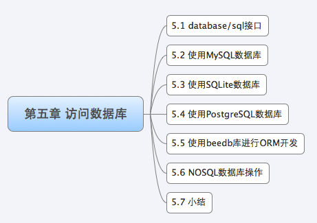

# 5 存取資料庫
對許多 Web 應用程式而言，資料庫都是其核心所在。資料庫幾乎可以用來儲存你想查詢和修改的任何資訊，比如使用者資訊、產品目錄或者新聞列表等。

Go 沒有內建的驅動支援任何的資料庫，但是 Go 定義了 database/sql 介面，使用者可以基於驅動介面開發相應資料庫的驅動，5.1 小節裡面介紹 Go 設計的一些驅動，介紹 Go 是如何設計資料庫驅動介面的。5.2 至 5.4 小節介紹目前使用的比較多的一些關係型資料驅動以及如何使用，5.5 小節介紹我自己開發一個 ORM 函式庫，基於 database/sql 標準介面開發的，可以相容幾乎所有支援 database/sql 的資料庫驅動，可以方便的使用 Go style 來進行資料庫操作。

目前 NOSQL 已經成為 Web 開發的一個潮流，很多應用採用了 NOSQL 作為資料庫，而不是以前的快取，5.6 小節將介紹 MongoDB 和 Redis 兩種 NOSQL 資料庫。

>[Go database/sql tutorial](http://go-database-sql.org/) 裡提供了慣用的範例及詳細的說明。

## 目錄
   

## links
   * [目錄](preface.md)
   * 上一章: [第四章總結](04.6.md)
   * 下一節: [database/sql 介面](05.1.md)
