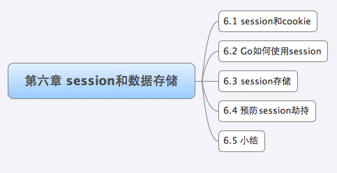

# 6 session 和資料儲存
Web 開發中一個很重要的議題就是如何做好使用者的整個瀏覽過程的控制，因為 HTTP 協議是無狀態的，所以使用者的每一次請求都是無狀態的，我們不知道在整個 Web 操作過程中哪些連線與該使用者有關，我們應該如何來解決這個問題呢？Web 裡面經典的解決方案是 cookie 和 session，cookie 機制是一種客戶端機制，把使用者資料儲存在客戶端，而 session 機制是一種伺服器端的機制，伺服器使用一種類似於散列表的結構來儲存資訊，每一個網站訪客都會被分配給一個唯一的標誌符，即 sessionID，它的存放形式無非兩種 : 要麼經過 url 傳遞，要麼儲存在客戶端的 cookies 裡.當然，你也可以將 Session 儲存到資料庫裡，這樣會更安全，但效率方面會有所下降。

6.1 小節裡面講介紹 session 機制和 cookie 機制的關係和區別，6.2 講解 Go 語言如何來實現 session，裡面講實現一個簡易的 session 管理器，6.3 小節講解如何防止 session 被劫持的情況，如何有效的保護 session。我們知道 session 其實可以儲存在任何地方，6.4 小節裡面實現的 session 是儲存在記憶體中的，但是如果我們的應用進一步擴充套件了，要實現應用的 session 共享，那麼我們可以把 session 儲存在資料庫中(memcache 或者 redis)，6.5 小節將詳細的講解如何實現這些功能。

## 目錄
   

## links
   * [目錄](preface.md)
   * 上一章: [第五章總結](05.7.md)
   * 下一節: [session 和 cookie](06.1.md)
