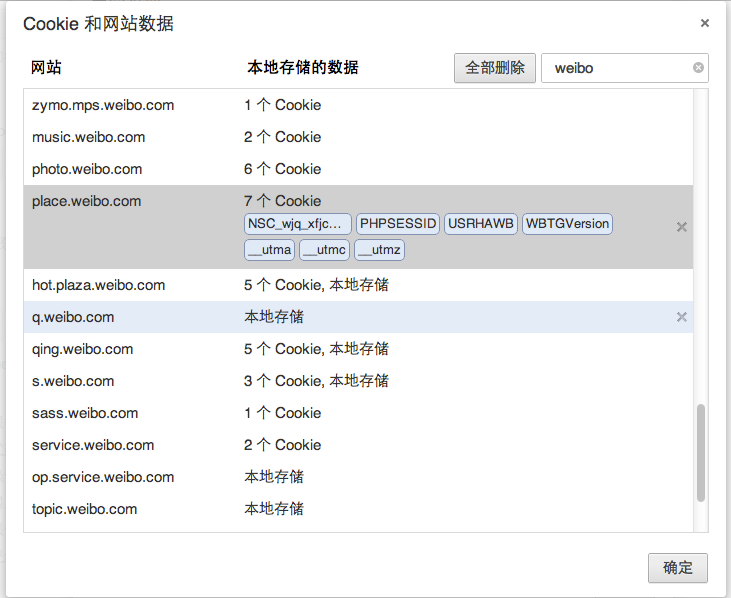

# 6.1 session 和 cookie
session 和 cookie 是網站瀏覽中較為常見的兩個概念，也是比較難以辨析的兩個概念，但它們在瀏覽需要認證的服務頁面以及頁面統計中卻相當關鍵。我們先來了解一下 session 和 cookie 怎麼來的？考慮這樣一個問題：

如何抓取一個訪問受限的網頁？如新浪微博好友的主頁，個人微博頁面等。

顯然，透過瀏覽器，我們可以手動輸入使用者名稱和密碼來訪問頁面，而所謂的“抓取”，其實就是使用程式來模擬完成同樣的工作，因此我們需要了解“登入”過程中到底發生了什麼。

當用戶來到微博登入頁面，輸入使用者名稱和密碼之後點選“登入”後瀏覽器將認證資訊 POST 給遠端的伺服器，伺服器執行驗證邏輯，如果驗證透過，則瀏覽器會跳轉到登入使用者的微博首頁，在登入成功後，伺服器如何驗證我們對其他受限制頁面的訪問呢？因為 HTTP 協議是無狀態的，所以很顯然伺服器不可能知道我們已經在上一次的 HTTP 請求中通過了驗證。當然，最簡單的解決方案就是所有的請求裡面都帶上使用者名稱和密碼，這樣雖然可行，但大大加重了伺服器的負擔（對於每個 request 都需要到資料庫驗證），也大大降低了使用者體驗(每個頁面都需要重新輸入使用者名稱密碼，每個頁面都帶有登入表單)。既然直接在請求中帶上使用者名稱與密碼不可行，那麼就只有在伺服器或客戶端儲存一些類似的可以代表身份的資訊了，所以就有了 cookie 與 session。

cookie，簡而言之就是在本地計算機儲存一些使用者操作的歷史資訊（當然包括登入資訊），並在使用者再次訪問該站點時瀏覽器透過 HTTP 協議將本地 cookie 內容傳送給伺服器，從而完成驗證，或繼續上一步操作。


圖 6.1 cookie 的原理圖

session，簡而言之就是在伺服器上儲存使用者操作的歷史資訊。伺服器使用 session id 來標識 session，session id 由伺服器負責產生，保證隨機性與唯一性，相當於一個隨機金鑰，避免在握手或傳輸中暴露使用者真實密碼。但該方式下，仍然需要將傳送請求的客戶端與 session 進行對應，所以可以藉助 cookie 機制來取得客戶端的標識（即 session id），也可以透過 GET 方式將 id 提交給伺服器。


圖 6.2 session 的原理圖

## cookie
Cookie 是由瀏覽器維持的，儲存在客戶端的一小段文字資訊，伴隨著使用者請求和頁面在 Web 伺服器和瀏覽器之間傳遞。使用者每次訪問站點時，Web 應用程式都可以讀取 cookie 包含的資訊。瀏覽器設定裡面有 cookie 隱私資料選項，開啟它，可以看到很多已訪問網站的 cookies，如下圖所示：



圖 6.3 瀏覽器端儲存的 cookie 資訊

cookie 是有時間限制的，根據生命期不同分成兩種：會話 cookie 和持久 cookie；

如果不設定過期時間，則表示這個 cookie 的生命週期為從建立到瀏覽器關閉為止，只要關閉瀏覽器視窗，cookie 就消失了。這種生命期為瀏覽會話期的 cookie 被稱為會話 cookie。會話 cookie 一般不儲存在硬碟上而是儲存在記憶體裡。

如果設定了過期時間(setMaxAge(60*60*24))，瀏覽器就會把 cookie 儲存到硬碟上，關閉後再次開啟瀏覽器，這些 cookie 依然有效直到超過設定的過期時間。儲存在硬碟上的 cookie 可以在不同的瀏覽器程序間共享，比如兩個 IE 視窗。而對於儲存在記憶體的 cookie，不同的瀏覽器有不同的處理方式。
　　

### Go 設定 cookie
Go 語言中透過 net/http 套件中的 SetCookie 來設定：
```Go

http.SetCookie(w ResponseWriter, cookie *Cookie)
```
w 表示需要寫入的  response，cookie 是一個 struct，讓我們來看一下 cookie 物件是怎麼樣的
```Go

type Cookie struct {
	Name       string
	Value      string
	Path       string
	Domain     string
	Expires    time.Time
	RawExpires string

// MaxAge=0 means no 'Max-Age' attribute specified.
// MaxAge<0 means delete cookie now, equivalently 'Max-Age: 0'
// MaxAge>0 means Max-Age attribute present and given in seconds
	MaxAge   int
	Secure   bool
	HttpOnly bool
	Raw      string
	Unparsed []string // Raw text of unparsed attribute-value pairs
}

```
我們來看一個例子，如何設定 cookie
```Go

expiration := time.Now()
expiration = expiration.AddDate(1, 0, 0)
cookie := http.Cookie{Name: "username", Value: "astaxie", Expires: expiration}
http.SetCookie(w, &cookie)
```
　　
### Go 讀取 cookie
上面的例子示範了如何設定 cookie 資料，我們這裡來示範一下如何讀取 cookie
```Go

cookie, _ := r.Cookie("username")
fmt.Fprint(w, cookie)
```
還有另外一種讀取方式
```Go

for _, cookie := range r.Cookies() {
	fmt.Fprint(w, cookie.Name)
}
```
可以看到透過 request 取得 cookie 非常方便。

## session

session，中文經常翻譯為會話，其本來的含義是指有始有終的一系列動作/訊息，比如打電話是從拿起電話撥號到結束通話電話這中間的一系列過程可以稱之為一個 session。然而當 session 一詞與網路協議相關聯時，它又往往隱含了“連線導向”和/或“保持狀態”這樣兩個含義。

session 在 Web 開發環境下的語義又有了新的擴充套件，它的含義是指一類別用來在客戶端與伺服器端之間保持狀態的解決方案。有時候 Session 也用來指這種解決方案的儲存結構。

session 機制是一種伺服器端的機制，伺服器使用一種類似於散列表的結構(也可能就是使用散列表)來儲存資訊。

但程式需要為某個客戶端的請求建立一個 session 的時候，伺服器首先檢查這個客戶端的請求裡是否包含了一個 session 標識－稱為 session id，如果已經包含一個 session id 則說明以前已經為此客戶建立過 session，伺服器就按照 session id 把這個 session 檢索出來使用(如果檢索不到，可能會建立一個，這種情況可能出現在伺服器端已經刪除了該使用者對應的 session 物件，但使用者人為地在請求的 URL 後面附加上一個 JSESSION 的參數)。如果客戶請求不包含 session id，則為此客戶建立一個 session 並且同時產生一個與此 session 相關聯的 session id，這個 session id 將在本次回應中回傳給客戶端儲存。

session 機制本身並不複雜，然而其實現和配置上的靈活性卻使得具體情況複雜多變。這也要求我們不能把僅僅某一次的經驗或者某一個瀏覽器，伺服器的經驗當作普遍適用的。

## 小結

如上文所述，session 和 cookie 的目的相同，都是為了克服 http 協議無狀態的缺陷，但完成的方法不同。session 透過 cookie，在客戶端儲存 session id，而將使用者的其他會話訊息儲存在伺服器端的 session 物件中，與此相對的，cookie 需要將所有資訊都儲存在客戶端。因此 cookie 存在著一定的安全隱患，例如本地 cookie 中儲存的使用者名稱密碼被破譯，或 cookie 被其他網站收集（例如：1. appA 主動設定域 B cookie，讓域 B cookie 取得；2. XSS，在 appA 上透過 javascript 取得 document.cookie，並傳遞給自己的 appB）。


透過上面的一些簡單介紹我們了解了 cookie 和 session 的一些基礎知識，知道他們之間的聯絡和區別，做 web 開發之前，有必要將一些必要知識了解清楚，才不會在用到時捉襟見肘，或是在調 bug 時如無頭蒼蠅亂轉。接下來的幾小節我們將詳細介紹 session 相關的知識。

## links
   * [目錄](<preface.md>)
   * 上一節: [session 和資料儲存](<06.0.md>)
   * 下一節: [Go 如何使用 session](<06.2.md>)
