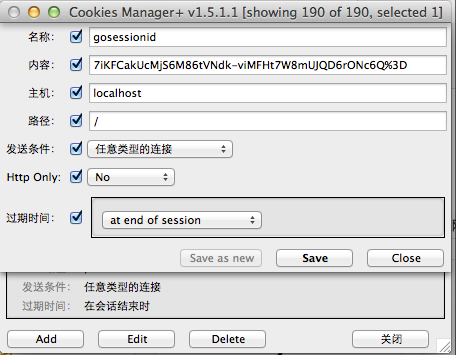
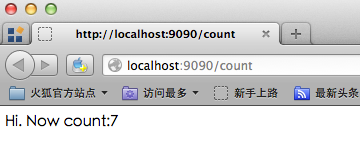

# 6.4 預防 session 劫持
session 劫持是一種廣泛存在的比較嚴重的安全威脅，在 session 技術中，客戶端和伺服器端透過 session 的識別符號來維護會話， 但這個識別符號很容易就能被嗅探到，從而被其他人利用。它是中間人攻擊的一種型別。

本節將透過一個例項來示範會話劫持，希望透過這個例項，能讓讀者更好地理解 session 的本質。
## session 劫持過程
我們寫了如下的程式碼來展示一個 count 計數器：
```Go

func count(w http.ResponseWriter, r *http.Request) {
	sess := globalSessions.SessionStart(w, r)
	ct := sess.Get("countnum")
	if ct == nil {
		sess.Set("countnum", 1)
	} else {
		sess.Set("countnum", (ct.(int) + 1))
	}
	t, _ := template.ParseFiles("count.gtpl")
	w.Header().Set("Content-Type", "text/html")
	t.Execute(w, sess.Get("countnum"))
}

```
count.gtpl 的程式碼如下所示：
```Go

Hi. Now count:{{.}}
```
然後我們在瀏覽器裡面重新整理可以看到如下內容：


圖 6.4 瀏覽器端顯示 count 數

隨著重新整理，數字將不斷增長，當數字顯示為 6 的時候，開啟瀏覽器(以 chrome 為例）的 cookie 管理器，可以看到類似如下的資訊：


圖 6.5 取得瀏覽器端儲存的 cookie

下面這個步驟最為關鍵: 開啟另一個瀏覽器(這裡我打開了 firefox 瀏覽器)，複製 chrome 位址列裡的地址到新開啟的瀏覽器的位址列中。然後開啟 firefox 的 cookie 模擬外掛，新建一個 cookie，把按上圖中 cookie 內容原樣在 firefox 中重建一份:



圖 6.6 模擬 cookie

Enter 後，你將看到如下內容：



圖 6.7 劫持 session 成功

可以看到雖然換了瀏覽器，但是我們卻獲得了 sessionID，然後模擬了 cookie 儲存的過程。這個例子是在同一臺計算機上做的，不過即使換用兩臺來做，其結果仍然一樣。此時如果交替點選兩個瀏覽器裡的連結你會發現它們其實操縱的是同一個計數器。不必驚訝，此處 firefox 盜用了 chrome 和 goserver 之間的維持會話的鑰匙，即 gosessionid，這是一種型別的“會話劫持”。在 goserver 看來，它從 http 請求中得到了一個 gosessionid，由於 HTTP 協議的無狀態性，它無法得知這個 gosessionid 是從 chrome 那裡“劫持”來的，它依然會去查詢對應的 session，並執行相關計算。與此同時 chrome 也無法得知自己保持的會話已經被“劫持”。
## session 劫持防範
### cookieonly 和 token
透過上面 session 劫持的簡單示範可以瞭解到 session 一旦被其他人劫持，就非常危險，劫持者可以假裝成被劫持者進行很多非法操作。那麼如何有效的防止 session 劫持呢？

其中一個解決方案就是 sessionID 的值只允許 cookie 設定，而不是透過 URL 重置方式設定，同時設定 cookie 的 httponly 為 true，這個屬性是設定是否可透過客戶端指令碼訪問這個設定的 cookie，第一這個可以防止這個 cookie 被 XSS 讀取從而引起 session 劫持，第二 cookie 設定不會像 URL 重置方式那麼容易取得 sessionID。

第二步就是在每個請求裡面加上 token，實現類似前面章節裡面講的防止 form 重複遞交類似的功能，我們在每個請求裡面加上一個隱藏的 token，然後每次驗證這個 token，從而保證使用者的請求都是唯一性。
```Go

h := md5.New()
salt:="astaxie%^7&8888"
io.WriteString(h,salt+time.Now().String())
token:=fmt.Sprintf("%x",h.Sum(nil))
if r.Form["token"]!=token{
	//提示登入
}
sess.Set("token",token)

```
### 間隔產生新的 SID
還有一個解決方案就是，我們給 session 額外設定一個建立時間的值，一旦過了一定的時間，我們銷燬這個 sessionID，重新產生新的 session，這樣可以一定程度上防止 session 劫持的問題。
```Go

createtime := sess.Get("createtime")
if createtime == nil {
	sess.Set("createtime", time.Now().Unix())
} else if (createtime.(int64) + 60) < (time.Now().Unix()) {
	globalSessions.SessionDestroy(w, r)
	sess = globalSessions.SessionStart(w, r)
}
```
session 啟動後，我們設定了一個值，用於記錄產生 sessionID 的時間。透過判斷每次請求是否過期(這裡設定了 60 秒)定期產生新的 ID，這樣使得攻擊者取得有效 sessionID 的機會大大降低。

上面兩個手段的組合可以在實踐中消除 session 劫持的風險，一方面，	由於 sessionID 頻繁改變，使攻擊者難有機會取得有效的 sessionID；另一方面，因為 sessionID 只能在 cookie 中傳遞，然後設定了 httponly，所以基於 URL 攻擊的可能性為零，同時被 XSS 取得 sessionID 也不可能。最後，由於我們還設定了 MaxAge=0，這樣就相當於 session cookie 不會留在瀏覽器的歷史記錄裡面。


## links
   * [目錄](<preface.md>)
   * 上一節: [session 儲存](<06.3.md>)
   * 下一節: [小結](<06.5.md>)
