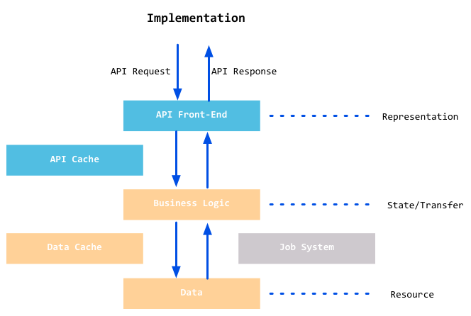

# 8.3 REST
RESTful，是目前最為流行的一種網際網路軟體架構。因為它結構清晰、符合標準、易於理解、擴充套件方便，所以正得到越來越多網站的採用。本小節我們將來學習它到底是一種什麼樣的架構？以及在 Go 裡面如何來實現它。
## 什麼是 REST
REST(REpresentational State Transfer)這個概念，首次出現是在 2000 年 Roy Thomas Fielding（他是 HTTP 規範的主要編寫者之一）的博士論文中，它指的是一組架構約束條件和原則。滿足這些約束條件和原則的應用程式或設計就是 RESTful 的。

要理解什麼是 REST，我們需要理解下面幾個概念:

- 資源（Resources）
  REST 是"表現層狀態轉化"，其實它省略了主語。"表現層"其實指的是"資源"的"表現層"。

  那麼什麼是資源呢？就是我們平常上網訪問的一張圖片、一個文件、一個視訊等。這些資源我們透過 URI 來定位，也就是一個 URI 表示一個資源。

- 表現層（Representation）

  資源是做一個具體的實體資訊，他可以有多種的展現方式。而把實體展現出來就是表現層，例如一個 txt 文字資訊，他可以輸出成 html、json、xml 等格式，一個圖片他可以 jpg、png 等方式展現，這個就是表現層的意思。

  URI 確定一個資源，但是如何確定它的具體表現形式呢？應該在 HTTP 請求的頭資訊中用 Accept 和 Content-Type 欄位指定，這兩個欄位才是對"表現層"的描述。

- 狀態轉化（State Transfer）

  訪問一個網站，就代表了客戶端和伺服器的一個互動過程。在這個過程中，肯定涉及到資料和狀態的變化。而 HTTP 協議是無狀態的，那麼這些狀態肯定儲存在伺服器端，所以如果客戶端想要通知伺服器端改變資料和狀態的變化，肯定要透過某種方式來通知它。

  客戶端能通知伺服器端的手段，只能是 HTTP 協議。具體來說，就是 HTTP 協議裡面，四個表示操作方式的動詞：GET、POST、PUT、DELETE。它們分別對應四種基本操作：GET 用來取得資源，POST 用來建立資源（也可以用於更新資源），PUT 用來更新資源，DELETE 用來刪除資源。

綜合上面的解釋，我們總結一下什麼是 RESTful 架構：

- （1）每一個 URI 代表一種資源；
- （2）客戶端和伺服器之間，傳遞這種資源的某種表現層；
- （3）客戶端透過四個 HTTP 動詞，對伺服器端資源進行操作，實現"表現層狀態轉化"。


Web 應用要滿足 REST 最重要的原則是 : 客戶端和伺服器之間的互動在請求之間是無狀態的，即從客戶端到伺服器的每個請求都必須包含理解請求所必需的資訊。如果伺服器在請求之間的任何時間點重啟，客戶端不會得到通知。此外此請求可以由任何可用伺服器回答，這十分適合雲端計算之類別的環境。因為是無狀態的，所以客戶端可以快取資料以改進效能。

另一個重要的 REST 原則是系統分層，這表示元件無法了解除了與它直接互動的層次以外的元件。透過將系統知識限制在單個層，可以限制整個系統的複雜性，從而促進了底層的獨立性。

下圖即是 REST 的架構圖：



圖 8.5 REST 架構圖

當 REST 架構的約束條件作為一個整體應用時，將產生一個可以擴充套件到大量客戶端的應用程式。它還降低了客戶端和伺服器之間的互動延遲。統一介面簡化了整個系統架構，改進了子系統之間互動的可見性。REST 簡化了客戶端和伺服器的實現，而且對於使用 REST 開發的應用程式更加容易擴充套件。

下圖展示了 REST 的擴充套件性：


圖 8.6 REST 的擴充套件性

## RESTful 的實現
Go 沒有為 REST 提供直接支援，但是因為 RESTful 是基於 HTTP 協議實現的，所以我們可以利用`net/http`套件來自己實現，當然需要針對 REST 做一些改造，REST 是根據不同的 method 來處理相應的資源，目前已經存在的很多自稱是 REST 的應用，其實並沒有真正的實現 REST，我暫且把這些應用根據實現的 method 分成幾個級別，請看下圖：


圖 8.7 REST 的 level 分級

上圖展示了我們目前實現 REST 的三個 level，我們在應用開發的時候也不一定全部按照 RESTful 的規則全部實現他的方式，因為有些時候完全按照 RESTful 的方式未必是可行的，RESTful 服務充分利用每一個 HTTP 方法，包括 `DELETE` 和`PUT`。可有時，HTTP 客戶端只能發出 `GET` 和`POST`請求：

- HTML 標準只能透過連結和表單支援 `GET` 和`POST`。在沒有 Ajax 支援的網頁瀏覽器中不能發出 `PUT` 或`DELETE`命令

- 有些防火牆會擋住 HTTP `PUT`和 `DELETE` 請求，要繞過這個限制，客戶端需要把實際的 `PUT` 和`DELETE`請求透過 POST 請求穿透過來。RESTful 服務則要負責在收到的 POST 請求中找到原始的 HTTP 方法並還原。

我們現在可以透過 `POST` 裡面增加隱藏欄位 `_method` 這種方式可以來模擬`PUT`、`DELETE`等方式，但是伺服器端需要做轉換。我現在的專案裡面就按照這種方式來做的 REST 介面。當然 Go 語言裡面完全按照 RESTful 來實現是很容易的，我們透過下面的例子來說明如何實現 RESTful 的應用設計。

```Go

package main

import (
	"fmt"
	"log"
	"net/http"

	"github.com/julienschmidt/httprouter"
)

func Index(w http.ResponseWriter, r *http.Request, _ httprouter.Params) {
	fmt.Fprint(w, "Welcome!\n")
}

func Hello(w http.ResponseWriter, r *http.Request, ps httprouter.Params) {
	fmt.Fprintf(w, "hello, %s!\n", ps.ByName("name"))
}

func getuser(w http.ResponseWriter, r *http.Request, ps httprouter.Params) {
	uid := ps.ByName("uid")
	fmt.Fprintf(w, "you are get user %s", uid)
}

func modifyuser(w http.ResponseWriter, r *http.Request, ps httprouter.Params) {
	uid := ps.ByName("uid")
	fmt.Fprintf(w, "you are modify user %s", uid)
}

func deleteuser(w http.ResponseWriter, r *http.Request, ps httprouter.Params) {
	uid := ps.ByName("uid")
	fmt.Fprintf(w, "you are delete user %s", uid)
}

func adduser(w http.ResponseWriter, r *http.Request, ps httprouter.Params) {
	// uid := r.FormValue("uid")
	uid := ps.ByName("uid")
	fmt.Fprintf(w, "you are add user %s", uid)
}

func main() {
	router := httprouter.New()
	router.GET("/", Index)
	router.GET("/hello/:name", Hello)

	router.GET("/user/:uid", getuser)
	router.POST("/adduser/:uid", adduser)
	router.DELETE("/deluser/:uid", deleteuser)
	router.PUT("/moduser/:uid", modifyuser)

	log.Fatal(http.ListenAndServe(":8080", router))
}

```
上面的程式碼示範了如何編寫一個 REST 的應用，我們訪問的資源是使用者，我們透過不同的 method 來訪問不同的函式，這裡使用了第三方函式庫`github.com/julienschmidt/httprouter`，在前面章節我們介紹過如何實現自訂的路由器，這個函式庫實現了自訂路由和方便的路由規則對映，透過它，我們可以很方便的實現 REST 的架構。透過上面的程式碼可知，REST 就是根據不同的 method 訪問同一個資源的時候實現不同的邏輯處理。

## 總結
REST 是一種架構風格，汲取了 WWW 的成功經驗：無狀態，以資源為中心，充分利用 HTTP 協議和 URI 協議，提供統一的介面定義，使得它作為一種設計 Web 服務的方法而變得流行。在某種意義上，透過強調 URI 和 HTTP 等早期 Internet 標準，REST 是對大型應用程式伺服器時代之前的 Web 方式的迴歸。目前 Go 對於 REST 的支援還是很簡單的，透過實現自訂的路由規則，我們就可以為不同的 method 實現不同的 handle，這樣就實現了 REST 的架構。

## links
   * [目錄](<preface.md>)
   * 上一節: [WebSocket](<08.2.md>)
   * 下一節: [RPC](<08.4.md>)
