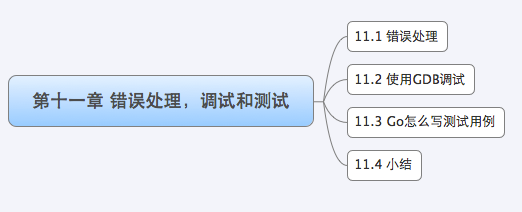

# 11 錯誤處理，除錯和測試

我們經常會看到很多程式設計師大部分的"程式設計"時間都花費在檢查 bug 和修復 bug 上。無論你是在編寫修改程式碼還是重構系統，幾乎都是花費大量的時間在進行故障排除和測試，外界都覺得我們程式設計師是設計師，能夠把一個系統從無做到有，是一項很偉大的工作，而且是相當有趣的工作，但事實上我們每天都是徘徊在排錯、除錯、測試之間。當然如果你有良好的習慣和技術方案來直面這些問題，那麼你就有可能將排錯時間減到最少，而儘可能的將時間花費在更有價值的事情上。

但是遺憾的是很多程式設計師不願意在錯誤處理、除錯和測試能力上下工夫，導致後面應用上線之後查詢錯誤、定位問題花費更多的時間。所以我們在設計應用之前就做好錯誤處理規劃、測試案例等，那麼將來修改程式碼、升級系統都將變得簡單。

開發 Web 應用過程中，錯誤自然難免，那麼如何更好的找到錯誤原因，解決問題呢？11.1 小節將介紹 Go 語言中如何處理錯誤，如何設計自己的套件、函式的錯誤處理，11.2 小節將介紹如何使用 GDB 來除錯我們的程式，動態執行情況下各種變數資訊，執行情況的監聽和除錯。

11.3 小節將對 Go 語言中的單元測試進行深入的探討，並範例如何來編寫單元測試，Go 的單元測試規則規範如何定義，以保證以後升級修改執行相應的測試程式碼就可以進行最小化的測試。

長期以來，培養良好的除錯、測試習慣一直是很多程式設計師逃避的事情，所以現在你不要再逃避了，就從你現在的專案開發，從學習 Go Web 開發開始養成良好的習慣。

## 目錄

## links

* [目錄](preface.md)
* 上一章: [第十章總結](10.4.md)
* 下一節: [錯誤處理](11.1.md)
