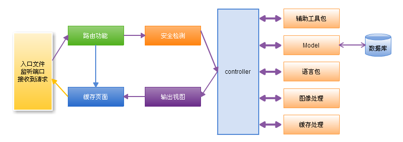

# 13.1 專案規劃
做任何事情都需要做好規劃，那麼我們在開發部落格系統之前，同樣需要做好專案的規劃，如何設定目錄結構，如何理解整個專案的流程圖，當我們理解了應用的執行過程，那麼接下來的設計編碼就會變得相對容易了
## gopath 以及專案設定
假設指定 gopath 是檔案系統的普通目錄名，當然我們可以隨便設定一個目錄名，然後將其路徑存入 GOPATH。前面介紹過 GOPATH 可以是多個目錄：在 window 系統設定環境變數；在 linux/MacOS 系統只要輸入終端命令`export gopath=/home/astaxie/gopath`，但是必須保證 gopath 這個程式碼目錄下面有三個目錄 pkg、bin、src。建立專案的原始碼放在 src 目錄下面，現在暫定我們的部落格目錄叫做 beeblog，下面是在 window 下的環境變數和目錄結構的截圖：

圖 13.1 環境變數 GOPATH 設定

圖 13.2 工作目錄在$gopath/src 下

## 應用程式流程圖
部落格系統是基於模型-檢視-控制器這一設計模式的。MVC 是一種將應用程式的邏輯層和表現層進行分離的結構方式。在實踐中，由於表現層從 Go 中分離了出來，所以它允許你的網頁中只包含很少的指令碼。

- 模型 (Model) 代表資料結構。通常來說，模型類別將包含取出、插入、更新資料庫資料等這些功能。
- 檢視 (View) 是展示給使用者的資訊的結構及樣式。一個檢視通常是一個網頁，但是在 Go 中，一個檢視也可以是一個頁面片段，如頁首、頁尾。它還可以是一個 RSS 頁面，或其它型別的“頁面”，Go 實現的 template 套件已經很好的實現了 View 層中的部分功能。
- 控制器 (Controller) 是模型、檢視以及其他任何處理 HTTP 請求所必須的資源之間的中介，並產生網頁。

下圖顯示了專案設計中框架的資料流是如何貫穿整個系統:

圖 13.3 框架的資料流

1. main.go 作為應用入口，初始化一些執行部落格所需要的基本資源，配置資訊，監聽埠。
2. 路由功能檢查 HTTP 請求，根據 URL 以及 method 來確定誰(控制層)來處理請求的轉發資源。
3. 如果快取檔案存在，它將繞過通常的流程執行，被直接傳送給瀏覽器。
4. 安全檢測：應用程式控制器呼叫之前，HTTP 請求和任一使用者提交的資料將被過濾。
5. 控制器裝載模型、核心函式庫、輔助函式，以及任何處理特定請求所需的其它資源，控制器主要負責處理業務邏輯。
6. 輸出檢視層中渲染好的即將傳送到 Web 瀏覽器中的內容。如果開啟快取，檢視首先被快取，將用於以後的常規請求。

## 目錄結構
根據上面的應用程式流程設計，部落格的目錄結構設計如下：

	|——main.go         入口檔案
	|——conf            配置檔案和處理模組
	|——controllers     控制器入口
	|——models          資料庫處理模組
	|——utils           輔助函式函式庫
	|——static          靜態檔案目錄
    |——views           檢視函式庫

## 框架設計
為了實現部落格的快速建立，打算基於上面的流程設計開發一個最小化的框架，框架包括路由功能、支援 REST 的控制器、自動化的範本渲染，日誌系統、配置管理等。

## 總結
本小節介紹了部落格系統從設定 GOPATH 到目錄建立這樣的基礎資訊，也簡單介紹了框架結構採用的 MVC 模式，部落格系統中資料流的執行流程，最後透過這些流程設計了部落格系統的目錄結構，至此，我們基本完成一個框架的建立，接下來的幾個小節我們將會逐個實現。
## links
   * [目錄](preface.md)
   * 上一章: [建構部落格系統](13.0.md)
   * 下一節: [自訂路由器設計](13.2.md)
