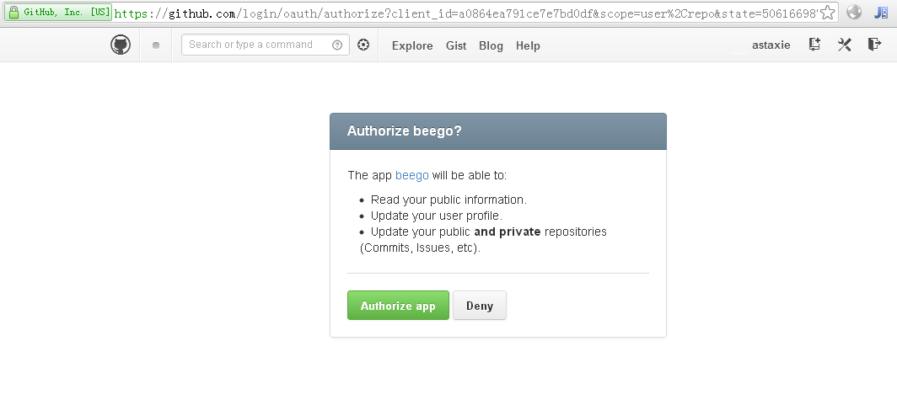
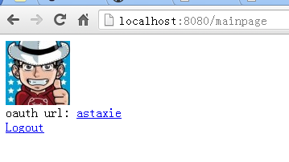

# 14.4 使用者認證
在開發 Web 應用過程中，使用者認證是開發者經常遇到的問題，使用者登入、註冊、登出等操作，而一般認證也分為三個方面的認證

- HTTP Basic 和 HTTP Digest 認證
- 第三方整合認證：QQ、微博、豆瓣、OPENID、google、github、facebook 和 twitter 等
- 自訂的使用者登入、註冊、登出，一般都是基於 session、cookie 認證

beego 目前沒有針對這三種方式進行任何形式的整合，但是可以充分的利用第三方開源函式庫來實現上面的三種方式的使用者認證，不過後續 beego 會對前面兩種認證逐步整合。

## HTTP Basic 和 HTTP Digest 認證
這兩個認證是一些應用採用的比較簡單的認證，目前已經有開源的第三方函式庫支援這兩個認證：
```Go

github.com/abbot/go-http-auth
```
下面程式碼示範瞭如何把這個函式庫引入 beego 中從而實現認證：
```Go

package controllers

import (
	"github.com/abbot/go-http-auth"
	"github.com/astaxie/beego"
)

func Secret(user, realm string) string {
	if user == "john" {
		// password is "hello"
		return "$1$dlPL2MqE$oQmn16q49SqdmhenQuNgs1"
	}
	return ""
}

type MainController struct {
	beego.Controller
}

func (this *MainController) Prepare() {
	a := auth.NewBasicAuthenticator("example.com", Secret)
	if username := a.CheckAuth(this.Ctx.Request); username == "" {
		a.RequireAuth(this.Ctx.ResponseWriter, this.Ctx.Request)
	}
}

func (this *MainController) Get() {
	this.Data["Username"] = "astaxie"
	this.Data["Email"] = "astaxie@gmail.com"
	this.TplNames = "index.tpl"
}
```
上面程式碼利用了 beego 的 prepare 函式，在執行正常邏輯之前呼叫了認證函式，這樣就非常簡單的實現了 http auth，digest 的認證也是同樣的原理。

## oauth 和 oauth2 的認證
oauth 和 oauth2 是目前比較流行的兩種認證方式，還好第三方有一個函式庫實現了這個認證，但是是國外實現的，並沒有 QQ、微博之類別的國內應用認證整合：
```Go

github.com/bradrydzewski/go.auth
```
下面程式碼示範瞭如何把該函式庫引入 beego 中從而實現 oauth 的認證，這裡以 github 為例示範：

1. 新增兩條路由
```Go

beego.RegisterController("/auth/login", &controllers.GithubController{})
beego.RegisterController("/mainpage", &controllers.PageController{})
```
2. 然後我們處理 GithubController 登陸的頁面：
```Go
package controllers

import (
	"github.com/astaxie/beego"
	"github.com/bradrydzewski/go.auth"
)

const (
	githubClientKey = "a0864ea791ce7e7bd0df"
	githubSecretKey = "a0ec09a647a688a64a28f6190b5a0d2705df56ca"
)

type GithubController struct {
	beego.Controller
}

func (this *GithubController) Get() {
	// set the auth parameters
	auth.Config.CookieSecret = []byte("7H9xiimk2QdTdYI7rDddfJeV")
	auth.Config.LoginSuccessRedirect = "/mainpage"
	auth.Config.CookieSecure = false

	githubHandler := auth.Github(githubClientKey, githubSecretKey)

	githubHandler.ServeHTTP(this.Ctx.ResponseWriter, this.Ctx.Request)
}

```
3. 處理登陸成功之後的頁面
```Go
package controllers

import (
	"github.com/astaxie/beego"
	"github.com/bradrydzewski/go.auth"
	"net/http"
	"net/url"
)

type PageController struct {
	beego.Controller
}

func (this *PageController) Get() {
	// set the auth parameters
	auth.Config.CookieSecret = []byte("7H9xiimk2QdTdYI7rDddfJeV")
	auth.Config.LoginSuccessRedirect = "/mainpage"
	auth.Config.CookieSecure = false

	user, err := auth.GetUserCookie(this.Ctx.Request)

	//if no active user session then authorize user
	if err != nil || user.Id() == "" {
		http.Redirect(this.Ctx.ResponseWriter, this.Ctx.Request, auth.Config.LoginRedirect, http.StatusSeeOther)
		return
	}

	//else, add the user to the URL and continue
	this.Ctx.Request.URL.User = url.User(user.Id())
	this.Data["pic"] = user.Picture()
	this.Data["id"] = user.Id()
	this.Data["name"] = user.Name()
	this.TplNames = "home.tpl"
}

```
整個的流程如下，首先開啟瀏覽器輸入地址：


圖 14.4 顯示帶有登入按鈕的首頁

然後點選連結出現如下介面：



圖 14.5 點選登入按鈕後顯示 github 的授權頁

然後點選 Authorize app 就出現如下介面：



圖 14.6 授權登入之後顯示的取得到的 github 資訊頁

## 自訂認證
自訂的認證一般都是和 session 結合驗證的，如下程式碼來源於一個基於 beego 的開源部落格：
```Go

//登陸處理
func (this *LoginController) Post() {
	this.TplNames = "login.tpl"
	this.Ctx.Request.ParseForm()
	username := this.Ctx.Request.Form.Get("username")
	password := this.Ctx.Request.Form.Get("password")
	md5Password := md5.New()
	io.WriteString(md5Password, password)
	buffer := bytes.NewBuffer(nil)
	fmt.Fprintf(buffer, "%x", md5Password.Sum(nil))
	newPass := buffer.String()

	now := time.Now().Format("2006-01-02 15:04:05")

	userInfo := models.GetUserInfo(username)
	if userInfo.Password == newPass {
		var users models.User
		users.Last_logintime = now
		models.UpdateUserInfo(users)

		//登入成功設定 session

		sess := globalSessions.SessionStart(this.Ctx.ResponseWriter, this.Ctx.Request)
		sess.Set("uid", userInfo.Id)
		sess.Set("uname", userInfo.Username)

		this.Ctx.Redirect(302, "/")
	}
}

//註冊處理
func (this *RegController) Post() {
	this.TplNames = "reg.tpl"
	this.Ctx.Request.ParseForm()
	username := this.Ctx.Request.Form.Get("username")
	password := this.Ctx.Request.Form.Get("password")
	usererr := checkUsername(username)
	fmt.Println(usererr)
	if usererr == false {
		this.Data["UsernameErr"] = "Username error, Please to again"
		return
	}

	passerr := checkPassword(password)
	if passerr == false {
		this.Data["PasswordErr"] = "Password error, Please to again"
		return
	}

	md5Password := md5.New()
	io.WriteString(md5Password, password)
	buffer := bytes.NewBuffer(nil)
	fmt.Fprintf(buffer, "%x", md5Password.Sum(nil))
	newPass := buffer.String()

	now := time.Now().Format("2006-01-02 15:04:05")

	userInfo := models.GetUserInfo(username)

	if userInfo.Username == "" {
		var users models.User
		users.Username = username
		users.Password = newPass
		users.Created = now
		users.Last_logintime = now
		models.AddUser(users)

		//登入成功設定 session

		sess := globalSessions.SessionStart(this.Ctx.ResponseWriter, this.Ctx.Request)
		sess.Set("uid", userInfo.Id)
		sess.Set("uname", userInfo.Username)
		this.Ctx.Redirect(302, "/")
	} else {
		this.Data["UsernameErr"] = "User already exists"
	}

}

func checkPassword(password string) (b bool) {
	if ok, _ := regexp.MatchString("^[a-zA-Z0-9]{4,16}$", password); !ok {
		return false
	}
	return true
}

func checkUsername(username string) (b bool) {
	if ok, _ := regexp.MatchString("^[a-zA-Z0-9]{4,16}$", username); !ok {
		return false
	}
	return true
}
```
有了使用者登陸和註冊之後，其他模組的地方可以增加如下這樣的使用者是否登陸的判斷：
```Go

func (this *AddBlogController) Prepare() {
	sess := globalSessions.SessionStart(this.Ctx.ResponseWriter, this.Ctx.Request)
	sess_uid := sess.Get("userid")
	sess_username := sess.Get("username")
	if sess_uid == nil {
		this.Ctx.Redirect(302, "/admin/login")
		return
	}
	this.Data["Username"] = sess_username
}
```
## links
   * [目錄](<preface.md>)
   * 上一節: [表單及驗證支援](<14.3.md>)
   * 下一節: [多語言支援](<14.5.md>)